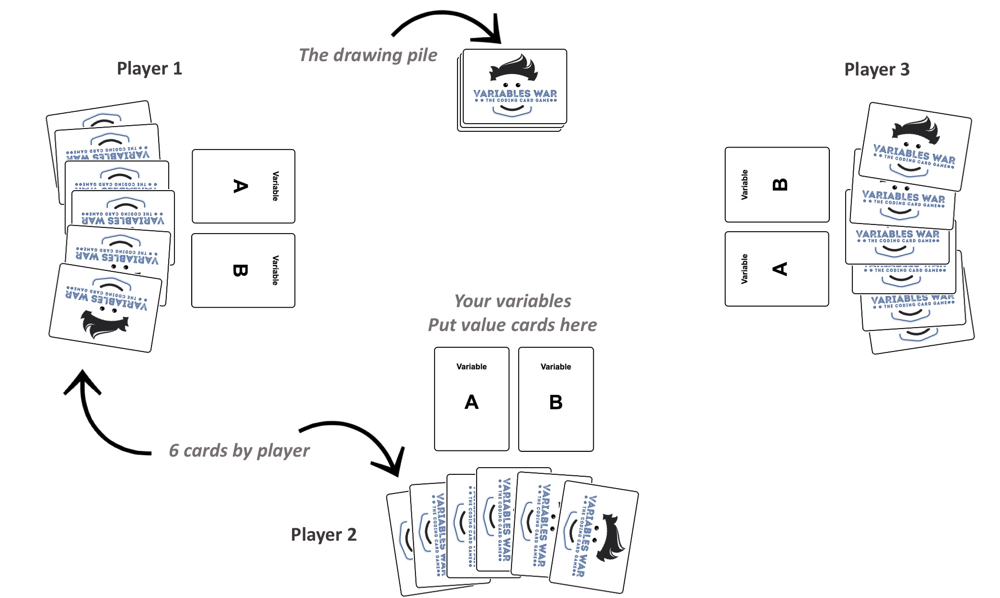

The Variable War is a card game to have a fun first contact with software programation. But as we figured... it's also a lot of fun when you are already familiar with software programation :)

# Game

- From 6 to 96 years old
- 2 to 6 players
- 45 minutes
- 106 cards

# Cards

- W Value Cards (Yellow)
- X Attack Cards (Red)
- Y Defense Cards (Green)
- Z Bonus Cards (Blue)

Each cards description is listed in the [Cards Description](CardsDescription.md) part.

# How to play

## Overview

The point is to reach 42 for either of variables A and B. When it's your turn, you start drawing 2 cards, then play 2 cards. For each card, you can either:
- play 1 Value card (yellow) on your variables to get closer to 42 on variable A or B. You can combine incremental cards with repeat cards.
- play 1 Value card (yellow) on another player's variables. For instance, you can decrease his variable value, or make it so that it matches a conditional attack.
- play an attack card (red) on other players's variables, to slow them down in their progress
- play a bonus card, either on yourself or on another player, depending on the card.
- any combination of the above.

## Game Setup

Each user has a variable declaration board in front of him. This is where he will increment his variables, and where all players can add attacks or bonus. A player shuffles the deck and deals 6 cards face down to each player. The remainder of the deck is left in the center of the table face down. It will be the drawing pile.

## Goal

The goal of this game is to reach a value of 42 for either of the 2 variables. If at the end of the drawing pile, no one has reached 42, the player who has a variable closest to 42 wins (even if he has more than 42). 

## Instructions

The player directly to the left of the dealer starts, then everyone plays turn by turn, clockwise.

When it's your turn, start drawing 2 cards from the drawing pile.

You must now play 2 cards. With each card you'll play, you can do either of the following:
- increase one of your variables by adding a Value Card.
- attack one or 2 another player by using an _Attack_ card. 
- remove an attack that was done to you by using a _Defense_ card.
- use a _Bonus_ card to attack, defend, or change the course of the game.

You can use the 2 cards independantly, but's it can be smarter to use a combination of 2 cards to ensure a better outcome. For instance:
- use a _Repeat 3_ card, and stack a _increment by 8_ card on top of it, to increment your variable by 24!
- give a _Memory Leak_ attack on another player, then put a _Increment by 2_ to one of his variable so that the variable value modulo 3 is equal to 0, and is reset to 0 :P
- play a _Open Source_ practice to see the other players cards, and play a _Mob Programing_ to get the most interesting hand from either of your direct neighbours :)

If you can't play, for instance if your code is frozen for 2 turns, you only have Value cards, and you don't want to give them to another player (understandably), then you must discard a card in the discard pile.

At the end of your turn, you must have 6 cards in hand.

If noone reaches 42, the game ends when the drawing pile is empty, and when the player who drew the last card played. If there was only one card left when he drew, he can only play one card.

