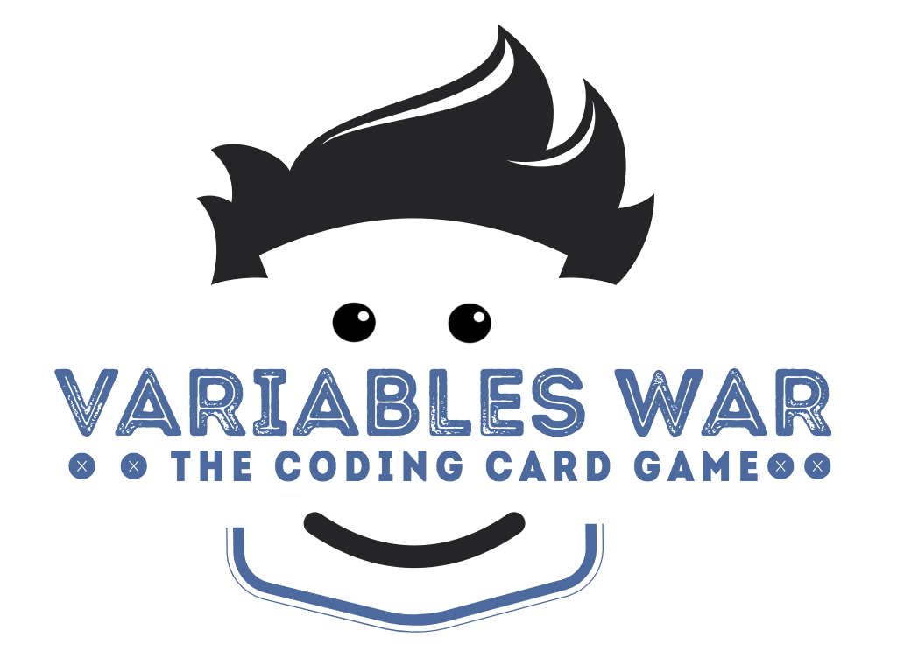
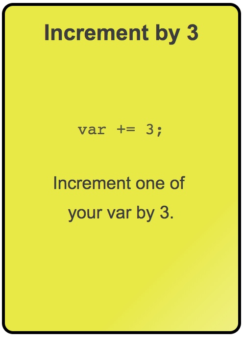
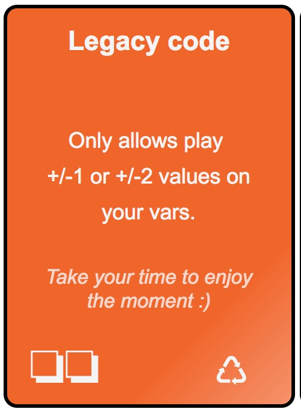
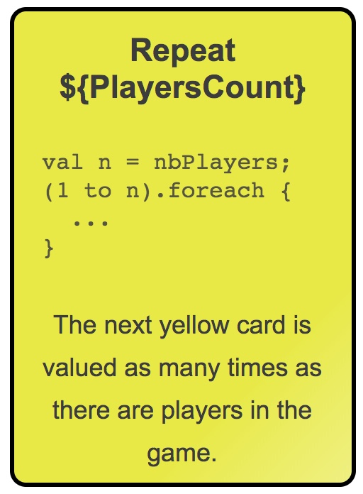
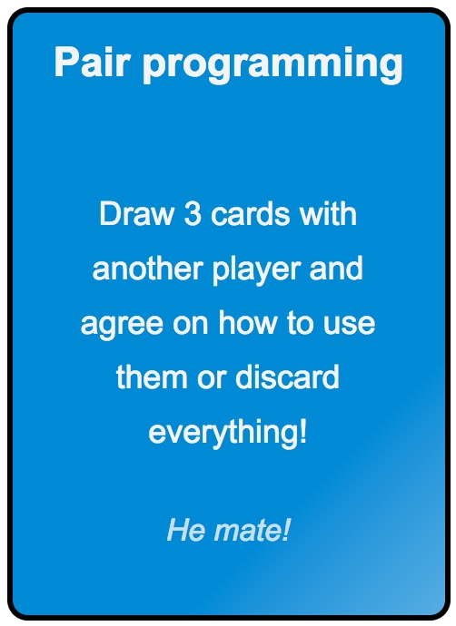
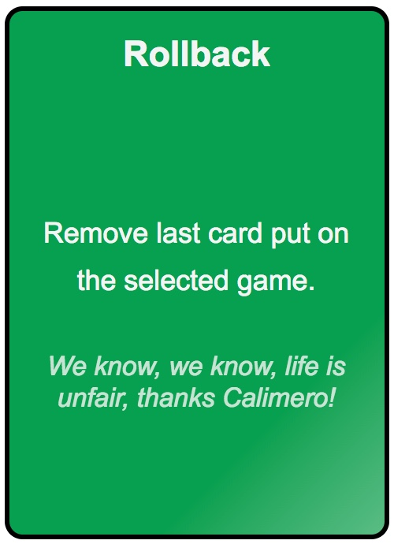
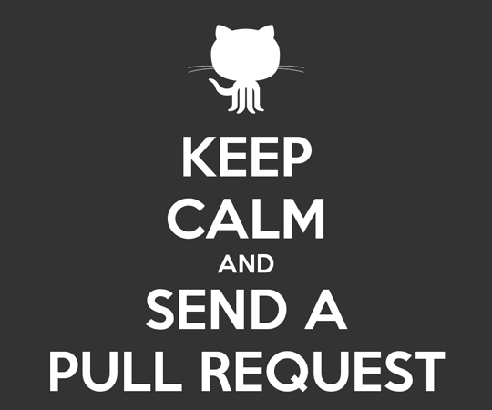

# Welcome to Variables War, the coding playing card game

    

You love this game? Please star us!

# What is this game about?

#### Technical requirements and general architecture

- From 7 to 96 years old
- 2 to 6 players, more you are more fun it will be!
- about 30 minutes, be the first to reach 42 or have the highest score when no card left
- 106 cards: values, loop, attacks, defense, bonus..
- always 6 cards by players

#### Coding it fun, even without an IDE! This game is Kids Friendly!

Each player has 2 variables declaration board in front of him: A and B. 
The goal is to be the first to reach 42 for one of your 2 variables. For that you will play cards to create a program that is updating them.
Different kid of cards will help you (or not) to do that: *values* and *loop* cards will help you to increment your variable value, all the other cards will be used slow down your opponents or defense yourself from an attack.

You probably noticed the geeky terminology we are using? Your're right we created the game to teach our own kids some software engineering and coding logic. And because we loved it, we are sharing it on this github. 

Playing this game we will:
- create a simple program that update values of your variables
- play with conditionals 
- play with loop
- learn many development related terms like from Memory leak, Refatoring or firewall to pull requests, pair programming and feature flipping!

The cards will allow you to create bugs on your opponent program, work together with team mates and race to be the first to reach 42!

We are sure you will love this game as much as we get pleasure to design it and test it with our friends and family!
Yes! Kids can definitely play! We designed it to be played by kids (with their parents) starting from 7 year old.

Enjoy :)

# The rules, how to play?

#### 2 variables by player, be the first the reach 42 points!

This is where he will increment his variables, and where all players can add attacks or bonus. 
A player shuffles the deck and deals 6 cards face down to each player. The remainder of the deck is left in the center of the table face down. It will be the drawing pile.

Each player got 2 variables: A and B
The goal is to reach 42 for either of variables A and B. 

When it's your turn, you start drawing 2 cards, then play 2 cards. 
For each card, you can either:
- play 1 Value card (yellow) on your variables to get closer to 42 on variable A or B. You can combine incremental cards with repeat cards.
- play 1 Value card (yellow) on another player's variables. For instance, you can decrease his variable value, or make it so that it matches a conditional attack.
- play an attack card (red) on other players's variables, to slow them down in their progress
- play a bonus card, either on yourself or on another player, depending on the card.
- any combination of the above.

#### 5 categories of cards: 
* *value*: used to increase or decrease the value of a Var, remember the goal is to reach exactly 42 point.

* *loop*: repeat the next card to be played on a variable, you will need them to go reach faster 42 or you can use them on their opponents to redeuce their score.

* *attacks*: freeze var, slow down speed or add requirements to your opponent stack. When you will have play several time you will eventually find some good opportunities to some on them on yourself.

* *defense*: Memory leak, refatoring or firewall, different way to counter attacks. Some of them will allow you to rewrite the history of you favorite variable.

* *bonus*: Game changer cards! You will definitively love those ones!

This are example of card, the full list is [available on this page](./CardsDescription.md).

More detailed [game rules are available here](./GameRules.md).

# Too much talking, I want to play!

| Order a physical deck                | Print your own deck and play!    |
|--------------------------------------|----------------------------------|
| *Coming soon, stay tuned..*          | *Print it now, obviously Free!*  |
| Star us so we could ping you back... | [Just print this page](http://htmlpreview.github.io/?https://raw.githubusercontent.com/kids-code-games/variables-war/master/card-maker/01_ourdeck/card-GENERATED.html) |
| 

 | 

 |

# Want to contributes, suggest cards?

We need help in many ways:
* *designing cards*, graphical materials, please be free to give us a hand!
* *exploring new ideas*, there are tons of alternatives cards could be added, we already added/deleted lots of cards according to all testing games to make this game as fun as possible, but we would love to create extensions!
* *marketing* and *community management*, help us to talk about this game

We are waiting your [suggestions / questions / feedbacks](https://github.com/kids-code-games/variables-war/issues)!*

   

# License

[Apache Version 2.0, January 2004](https://www.apache.org/licenses/LICENSE-2.0)

