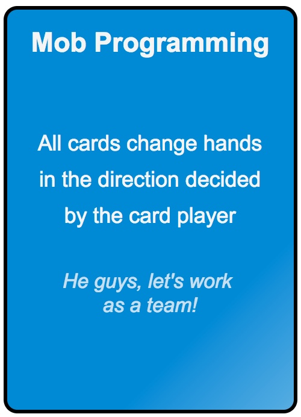
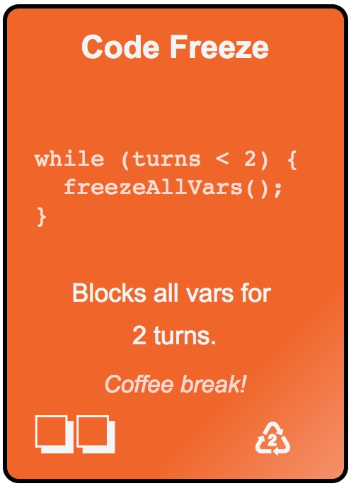
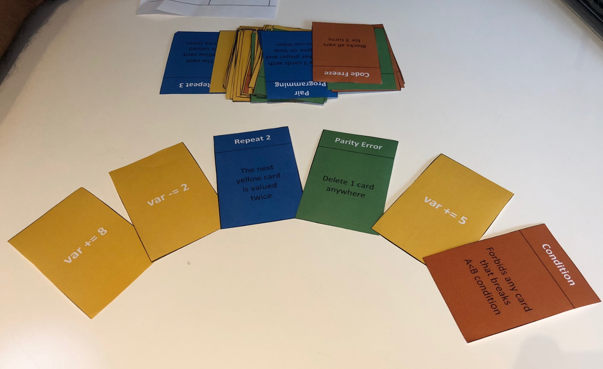

# Welcome to Variables War, the coding card game

    

You love this game? Please star us!

# What is this game about?

#### Technical requirements and general architecture

- From 7 to 96 years old
- 2 to 6 players, the more you are the funner it will be!
- about 30 minutes, be the first to reach 42 or have the highest score when there is no card left
- 106 cards: values, loops, attacks, defense, bonus..
- always 6 cards by players

#### Coding is fun, even without an IDE! This game is (natively) Kids Friendly!

The goal is to be the first to reach 42 for either of your 2 variables. For that, you will have to create a program that gets them closer to 42.
Different kind of cards will help you achieve that, if you are lucky enough: *values* and *loop* cards will help you increment your variable value. All the other cards will be used to slow down your opponents or defend yourself from a previous attack.

You probably noticed the geeky terminology we are using? We created this game to teach our own kids a bit of software engineering and coding practices.
But because we loved it, even more than expected, we chose to share it on github. 

By playing this game you will:
- create a simple program that updates the values of your variables
- play with conditions and requirements
- play with loop, or merge the values of your variables
- learn many development related terms like from *Memory leak*, *Refactoring* or *Firewall* to ... *Pull requests*, *Pair programming* and *Feature flipping*!

The cards will allow you to create bugs on your opponent's program, work together with team mates and race to be the first to reach 42!

We are sure you will love this game as much as we took pleasure designing it and trying it (again and again) with our friends and family!
Yes! Kids can definitely play! We designed it to be played by kids (with their parents) starting from 7 year old (or as soon as they show any kind of interest about it).

Enjoy :)

# The rules, how to play?

#### 2 variables by player, be the first the reach 42 points!

Each player has 2 variables: A and B.

This is where the player will increment their respective values using his own strategy to avoid attack and maximize benefits of loops and bonuses.

The goal is to reach 42 for either of variables A and B. 

When it's your turn, you start drawing 2 cards, then play 2 cards to always have 6 cards in hands.

#### 5 categories of cards: 

* *value*: used to increase or decrease the value of a Var. Remember the goal is to reach exactly 42 points. But if the deck is empty before anyone reached 42, then the player who is the closest to 42 wins (there can be draws).

* *loop*: repeat the next card to be played on a variable. You will need them to reach 42 faster, or you can use them on their opponents to reduce their score (for instance, by putting a repeat 3 and a -5 cards on an oppponent's variable)

* *attacks*: freeze var, slow down speed or add requirements to your opponent stack. After playing a few times you will figure out some tricky associations of attacks.

* *defense*: rollback, refatoring or firewall, different ways to counter attacks. Some of them will allow you to rewrite the history of you favorite variable.

* *bonus*: Game changer cards! You will definitively love those ones!

This are example of card, the full list is [available on this page](./CardsDescription.md).

More detailed [game rules are available here](./GameRules.md).

# Too much talking, I want to play!

| Order a physical deck                | Print your own deck and play!    |
|--------------------------------------|----------------------------------|
| *Coming soon, stay tuned..*          | *Print it now, obviously Free!*  |
| Star us so we could ping you back... | [Just print this page](http://htmlpreview.github.io/?https://raw.githubusercontent.com/kids-code-games/variables-war/master/card-maker/01_ourdeck/card-GENERATED.html) |
| 

 | 

 |

# Want to contributes, suggest cards?

We need help in many ways:
* *designing cards*, graphical materials, please feel free to give us a hand!
* *exploring new ideas*, there are tons of alternatives cards could be added, we already added/deleted lots of cards according to all testing games to make this game as fun as possible, but we would love to create extensions!
* *marketing* and *community management*, help us to talk about this game

We are waiting your [suggestions / questions / feedbacks](https://github.com/kids-code-games/variables-war/issues)!*

   

# Git History

As a bonus, this is a photo of one of our high technology (paper) and (deprecated) prototype we tested several months ago.

 

# License

[Apache Version 2.0, January 2004](https://www.apache.org/licenses/LICENSE-2.0)
